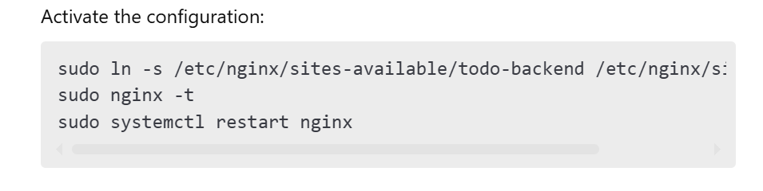
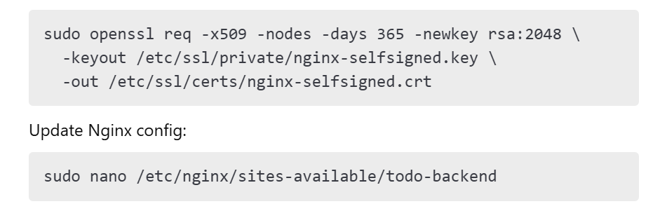

**MERN Stack: Explanation & To-Do App Deployment .**

**1. What is the MERN Stack?**

The **MERN stack** is a combination of **MongoDB, Express.js, React.js,
and Node.js**, used to build full-stack web applications.

**1.1 Components of MERN**

-   **MongoDB** → A NoSQL database used to store application data.

-   **Express.js** → A lightweight web framework for Node.js to create
    API endpoints.

-   **React.js** → A front-end JavaScript library used for building
    interactive UIs.

-   **Node.js** → A JavaScript runtime for running server-side
    applications.

**1.2 MERN Architecture**

1.  **Frontend (React.js)** → Sends HTTP requests to the backend.

2.  **Backend (Node.js + Express.js)** → Handles requests, communicates
    with MongoDB, and sends responses.

3.  **Database (MongoDB)** → Stores user data and tasks.

------------------------------------------------------------------------

**2. Steps to Deploy the MERN To-Do App on AWS EC2**

**Step 1: Launch an EC2 Instance**

1.  Go to the **AWS EC2 Dashboard**.

2.  Click **Launch Instance**.

3.  Choose **Ubuntu 22.04 LTS** as the OS.

4.  Select **t2.micro** instance type (Free Tier eligible).

5.  Configure security groups:

    -   Allow **HTTP (80)** and **HTTPS (443)**.

    -   Allow **Custom TCP (3000, 5000)** for backend.

6.  Launch the instance and note the **Public IP** (e.g., 3.87.217.243).

**Step 2: Connect to the EC2 Instance**

Use **EC2 Instance Connect** from the AWS Console.

**Step 3: Install Dependencies (Node.js, MongoDB, Git, and PM2)**

**Step 4: Clone the To-Do App Repository**

**Step 5: Deploy Frontend Using Vercel**

**Step 6: Configure Nginx as a Reverse Proxy**

**Step 7: Secure Nginx with SSL (Self-Signed
Certificate)**

Modify:

**Step 8: Test API Endpoints Using Postman and Browser for TODO-APP**

**8.1 Check if Backend is Running**

1.  Open **Postman**.

2.  Make a **GET request** to:

**Conclusion**

By following this guide, you have successfully deployed a MERN To-Do app
on an AWS EC2 instance. The backend runs using **PM2**, the frontend is
deployed with **Vercel**, and **Nginx** acts as a reverse proxy. tested
API with Postman and ensure everything runs smoothly.
